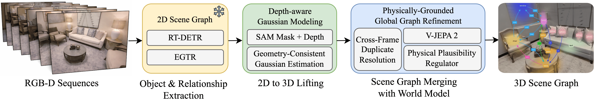

<div align="center">

# DeWorldSG: Depth-Aware 3D Semantic Scene Graph Generation via World-Model Priors

Seok-Young Kim, Abdelrahman Elskhawy, Taewook Ha, Dooyoung Kim, Eunjae Shin, Benjamin Busam, Woontack Woo

[Project Page](https://deworldsg2026.github.io)

</div>

<p align="center"></p>

DeWorldSG generates spatio-temporally coherent 3D semantic scene graphs from RGB-D sequences.
Each object is lifted to a depth-aware 3D Gaussian estimated from SAM 3 instance masks and Dual-Domain Depth Refinement (DDR),
and relations are refined with spatio-temporal priors from the V-JEPA 2 video world model.
This codebase is built on [FROSS](https://github.com/Howardkhh/FROSS).

## Table of Contents
- [Installation](#installation)
- [Prepare Dataset](#prepare-dataset)
  - [Download 3RScan dataset](#1-download-3rscan-dataset)
  - [Extract and preprocess 3RScan dataset](#2-extract-and-preprocess-3rscan-dataset)
  - [Prepare datasets for object detection, 2D scene graph generation, and 3D scene graph generation](#3-prepare-datasets-for-object-detection-2d-scene-graph-generation-and-3d-scene-graph-generation)
- [Download Pretrained Weights](#download-pretrained-weights)
- [Run DeWorldSG](#run-deworldsg)
- [Evaluate DeWorldSG](#evaluate-deworldsg)
- [Acknowledgements](#acknowledgements)
- [Citation](#citation)

## Installation
Tested with Python 3.10, PyTorch 2.5.1 and CUDA 12.1 on Ubuntu 22.04.
### Prerequisites
- libvips-dev

### Install Dependencies
```bash
git clone https://github.com/SeokyoungXR/DeWorldSG.git
cd DeWorldSG
pip install -r requirements.txt
pip install -e sam3
cd EGTR/lib/fpn
sh make.sh
cd ../../..
```

SAM 3 checkpoints are downloaded from Hugging Face on first use.
Request access to [facebook/sam3](https://huggingface.co/facebook/sam3) and log in with `huggingface-cli login` beforehand.

## Prepare Dataset
#### 1. Download 3RScan dataset
Agree to the terms of use and get the download script from [here](https://forms.gle/NvL5dvB4tSFrHfQH6) and save it as `3RScan.py`.
You may want to parallelize the script for faster download speed.
```bash
python 3RScan.py -o Datasets/3RScan/data
wget "http://campar.in.tum.de/public_datasets/3RScan/3RScan.json" -P Datasets/3RScan/data
wget "http://campar.in.tum.de/public_datasets/3DSSG/3DSSG/objects.json" -P Datasets/3RScan/data
wget "http://campar.in.tum.de/public_datasets/3DSSG/3DSSG/relationships.json" -P Datasets/3RScan/data
```

#### 2. Extract and preprocess 3RScan dataset
```bash
git clone https://github.com/WaldJohannaU/3RScan.git
cd 3RScan/c++
```
Build the rio_renderer (not rio_example) following the instructions in the [3RScan repository](https://github.com/WaldJohannaU/3RScan/tree/master/c%2B%2B).
<details>

<summary>Encounter error when building rio_renderer?</summary>

If you encounter error similar to the below when building rio_renderer with `make` command:
```bash
[ 50%] Linking CXX executable rio_renderer
 /usr/bin/ld: CMakeFiles/rio_renderer.dir/src/renderer.cc.o: warning: relocation against `__glewGenVertexArrays' in read-only section `.text._ZN5Model11processMeshEP6aiMeshPK7aiScene[_ZN5Model11processMeshEP6aiMeshPK7aiScene]'
 /usr/bin/ld: CMakeFiles/rio_renderer.dir/src/renderer.cc.o: in function `RIO::Renderer::ReadRGB(cv::Mat&)':                        renderer.cc:(.text+0x1ed0): undefined reference to `__glewBindFramebuffer'
 /usr/bin/ld: CMakeFiles/rio_renderer.dir/src/renderer.cc.o: in function `RIO::Renderer::Render(Model&, Shader&)':                  renderer.cc:(.text+0x2d95): undefined reference to `__glewUseProgram'
 /usr/bin/ld: renderer.cc:(.text+0x2ddf): undefined reference to `__glewUniformMatrix4fv'
 usr/bin/ld: renderer.cc:(.text+0x2ed8): undefined reference to `__glewGetUniformLocation'
 usr/bin/ld: renderer.cc:(.text+0x3016): undefined reference to `__glewUniform1i'
 usr/bin/ld: renderer.cc:(.text+0x3042): undefined reference to `__glewGetUniformLocation'
 usr/bin/ld: renderer.cc:(.text+0x322e): undefined reference to `__glewActiveTexture'
 usr/bin/ld: renderer.cc:(.text+0x35aa): undefined reference to `__glewBindVertexArray'
 usr/bin/ld: renderer.cc:(.text+0x35cf): undefined reference to `__glewBindVertexArray'
 usr/bin/ld: renderer.cc:(.text+0x35ea): undefined reference to `__glewActiveTexture'
```
Try patching the `CMakeLists.txt` file with the following:
```bash
cd ../../.. # back to 3RScan directory
git apply ../Scripts/files/rio_renderer.patch
cd c++/rio_renderer/build
make # and try to make again
```
</details>

<br/>
Render depth maps from the 3RScan dataset using the renderer.

You may need a vnc server to run the renderer in a headless environment.
(For example: `vncserver && export DISPLAY=:1.0`)

```bash
cd ../../../.. # back to DeWorldSG directory
python3 Scripts/dataset/extract_and_preprocess_3RScan.py --path ./Datasets/3RScan/ --rio_renderer_path ./3RScan/c++/rio_renderer/build/
```

Check data integrity.
```bash
python Scripts/dataset/check.py --path Datasets/3RScan
```
The output should look like below.
```bash
Number of folders: 1482
Number of folders with sequence folder: 1482
Number of folders with all images: 1482
Number of images: 363555
Number of images with bounding box files: 363555
Number of rendered color images: 363555
Number of rendered depth images: 363555
Number of rendered label images: 363555
Number of visibility files: 363555
Number of instance files: 363555
```

#### 3. Prepare datasets for object detection, 2D scene graph generation, and 3D scene graph generation
```bash
cd Scripts
bash prepare_datasets.sh
cd ..
```

## Download Pretrained Weights
#### RT-DETR-EGTR (2D scene graph)
The pretrained RT-DETR-EGTR weights are provided by FROSS:
- [3RScan](https://drive.google.com/file/d/1k7PLsY0CqbZbBHeKU8yA2Eof8wFh4Hap/view?usp=sharing)

Extract and put them into the `weights/RT-DETR-EGTR` directory. You may skip the next two steps if you have downloaded the pretrained weights.
```bash
mkdir -p weights/RT-DETR-EGTR
cd weights/RT-DETR-EGTR
# Put the downloaded weight zip files here
unzip 3RScan20.zip
cd ../..
```

Export the model to ONNX and TensorRT format:
```bash
PYTHONPATH=. python Scripts/tools/export_onnx_trt.py --artifact_path weights/RT-DETR-EGTR/3RScan20/egtr__RT-DETR__3RScan20__last.pth/batch__6__epochs__50_25__lr__2e-07_2e-06_0.0002__finetune/version_0
```

#### V-JEPA 2 backbone and relation probe
Download the V-JEPA 2 ViT-g/16 (384px) checkpoint, and download the relation probe `vjepa_probe_mlp.pt` from [Google Drive](https://drive.google.com/drive/folders/1Iwu9IchFkysWUmqAXytWW7wJMSBVVX4g?usp=sharing) into `Merging/probes/`:
```bash
wget https://dl.fbaipublicfiles.com/vjepa2/vitg-384.pt -P weights
mkdir -p Merging/probes
mv ~/Downloads/vjepa_probe_mlp.pt Merging/probes/  # adjust to where you downloaded it
```

## Run DeWorldSG
<details>
<summary><code>main.py</code> parameters</summary>

- `--use_gt_sg`: Use the ground truth 2D scene graph instead of RT-DETR-EGTR prediction.
- `--not_use_gt_pose`: Use SLAM trajectory instead of ground truth camera pose.
- `--not_preload`: Do not preload all images into memory prior to running each scene. Set this if you run out of RAM. Disable this if you are measuring runtime performance.
- `--classes_dist_method`: Method to compute class distribution distance. `dot_product` (default) is the inner-product class distance used in the paper.
- `--refiner_model_path`: V-JEPA 2 backbone checkpoint (default: `weights/vitg-384.pt`).
- `--refiner_probe_path`: Relation probe checkpoint (default: `Merging/probes/vjepa_probe_mlp.pt`).
</details>

```bash
cd Merging
python main.py --artifact_path ../weights/RT-DETR-EGTR/3RScan20/egtr__RT-DETR__3RScan20__last.pth/batch__6__epochs__50_25__lr__2e-07_2e-06_0.0002__finetune/version_0/ --dataset_path ../Datasets/3RScan
```

## Evaluate DeWorldSG
```bash
python evaluate.py --dataset_path ../Datasets/3RScan/ --prediction_path output/scannet/predictions_gaussian_obj0.7_rel10_merging0.7_classdist_dot_product0.3_test_gtpose_sam3_postprocessing.pkl
```

### Evaluate the paper's predictions
To evaluate the predictions reported in the paper without running inference, download the prediction files from [Google Drive](https://drive.google.com/drive/folders/1Iwu9IchFkysWUmqAXytWW7wJMSBVVX4g?usp=sharing):
- `deworldsg_3rscan_predictions.pkl` into `Merging/output/scannet/`
- `deworldsg_replica_predictions.pkl` into `Merging/output/replica/`

Evaluating the ReplicaSSG predictions only requires the ReplicaSSG annotations. Download and process the dataset according to the [ReplicaSSG instructions](https://github.com/Howardkhh/ReplicaSSG) and move it to `./Datasets` (e.g. `mv ~/ReplicaSSG/Replica ./Datasets`).

```bash
# 3RScan
python evaluate.py --dataset_path ../Datasets/3RScan/ --prediction_path output/scannet/deworldsg_3rscan_predictions.pkl
# ReplicaSSG
python evaluate.py --dataset_path ../Datasets/Replica/ --label_categories replica --prediction_path output/replica/deworldsg_replica_predictions.pkl
```

## Acknowledgements
Relevant work: [FROSS](https://github.com/Howardkhh/FROSS)

**Disclaimer:** This is a code repository for reference only; in case of any discrepancies, the paper shall prevail.

We sincerely thank to FROSS for providing the baseline code.

This project builds on the following works:
- [FROSS](https://github.com/Howardkhh/FROSS)
- [RT-DETR](https://github.com/lyuwenyu/RT-DETR)
- [EGTR](https://github.com/naver-ai/egtr)
- [SAM 3](https://github.com/facebookresearch/sam3)
- [V-JEPA 2](https://github.com/facebookresearch/vjepa2)
- [3RScan](https://github.com/WaldJohannaU/3RScan)
- [3DSSG](https://3dssg.github.io/)
- [ReplicaSSG](https://github.com/Howardkhh/ReplicaSSG)
- [Replica](https://github.com/facebookresearch/Replica-Dataset)

## Citation
```bibtex
@inproceedings{kim2026deworldsg,
  title     = {DeWorldSG: Depth-Aware 3D Semantic Scene Graph Generation via World-Model Priors},
  author    = {Kim, Seok-Young and Elskhawy, Abdelrahman and Ha, Taewook and Kim, Dooyoung and Shin, Eunjae and Busam, Benjamin and Woo, Woontack},
  booktitle = {European Conference on Computer Vision (ECCV)},
  year      = {2026}
}
```
